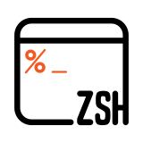
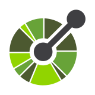

	<h1>你好啊，这里是云枫</h1>
	
<em>一片叶，一朵云，一棵枫树，围成一道栅栏</em>

	
<a href="README.md">English</a> · 简体中文

	
编程使我快乐（调试的时候除外）

---

## 🟪🌳 关于我

**初学者 & 大学生**，正探索着感兴趣的一切：
- 💻 **Linux 用户** —— 开源软件是好文明
- 🔗 **业余运维** —— 在日志里大海捞针：`gcx logs query '{service_name="Traefik"} | rg Error | sort | tail -15`
- ⌨️ **终端爱好者** —— 信奉 Unix 哲学：做好一件事
- ⌛ **Vibe Coding** —— *“下午好，云枫，有什么我可以帮到你的？”*
- 🪵 **本体** —— 一道紫杉木栅栏，拦不住好奇心，但划得清边界

---

## 🛠️ 技术武器库

### **编程语言 & 框架**

### **开发工具**

### **基础设施**

### **AI 生态**

> 要学的东西还有很多，要走的路还有很长

---

## 🤗 正在鼓捣
- 像 [Komodo](https://komo.do/) 一样思考
- 跟着 [A Tour of Go](https://go.dev/tour/) 四处逛逛
- 钥匙分开挂，权限抠着给，定期拉去做体检，陌生流量先怀疑三分 —— 自己的防线自己筑
- 开发时 [mise](https://mise.jdx.dev) 会让每件工具各就各位，生产环境用[容器](https://github.com/docker/compose)界定边界
- 一只脚踏进了 [Rust](https://beatai.org/rust-course) 的世界，进度：0

> *我想留在大家身边，从过去，一同迈向明天*

---

## Github 心跳

  

